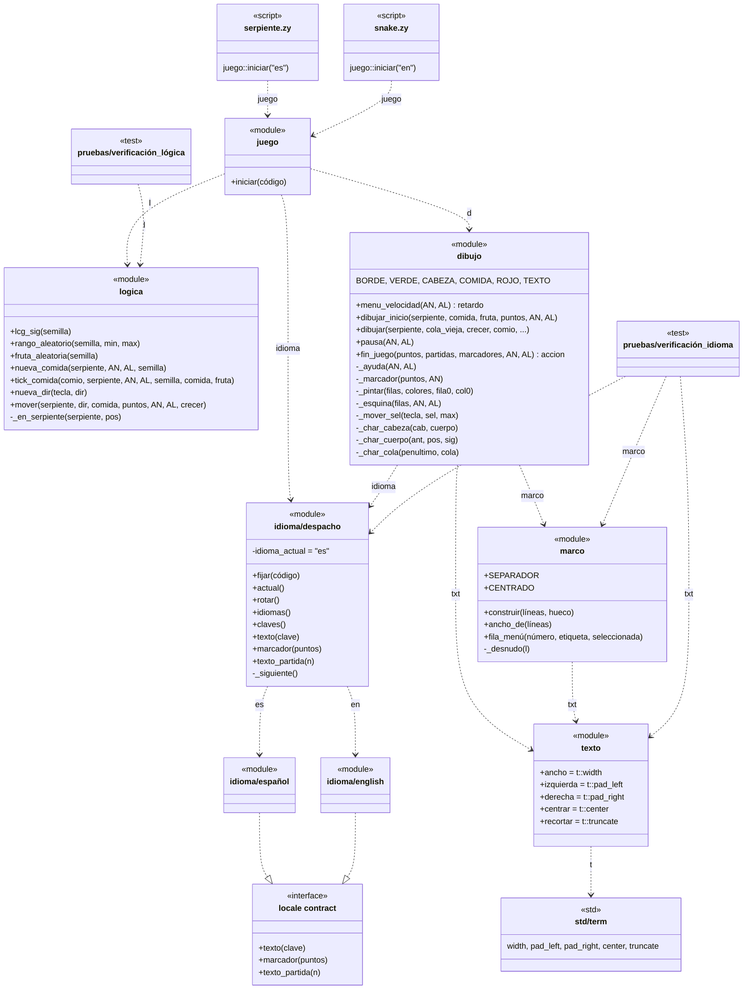
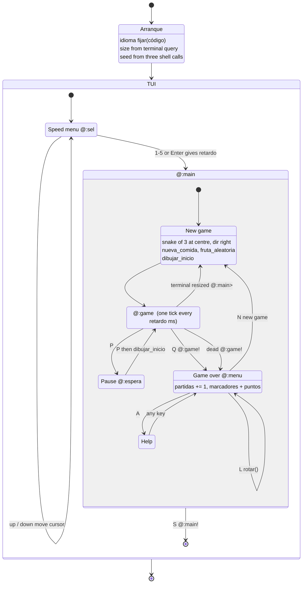
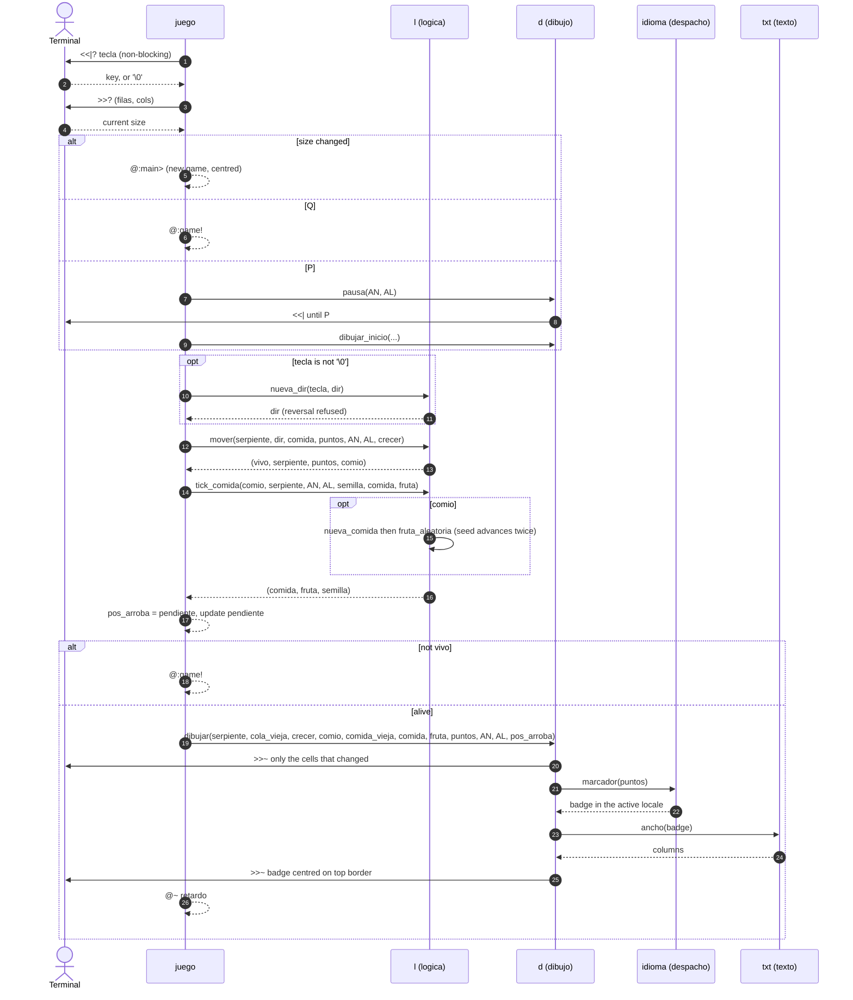
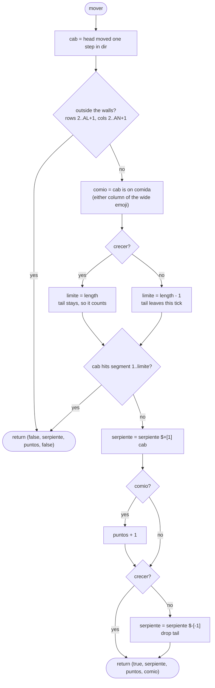
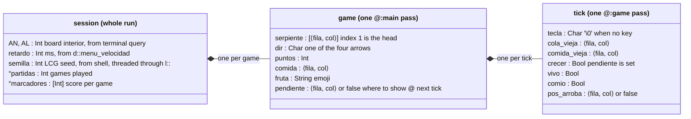

# Serpiente — diagrams

A first look at which UML views fit a Zymbol program. Zymbol has no
classes, so there is no class diagram here; what it has instead is
modules with state and an export list, labelled loops, and functions
that hand state back through tuples. Each diagram below is chosen to
show one of those.

Identifiers in the diagrams are the program's own (Spanish); Mermaid
node ids are ASCII with the real name as the label, because accented
ids break Mermaid's parser.

| # | View | UML diagram | What it shows about Zymbol |
|---|------|-------------|----------------------------|
| 1 | Modules | component (drawn as `classDiagram`) | `# módulo`, `#>` exports, `<#` imports with alias, module state |
| 2 | Screens | state machine | labelled loops `@:main`, `@:game` and their `>` / `!` exits |
| 3 | One tick | sequence | state threaded through return tuples, terminal I/O |
| 4 | `l::mover` | activity | the one function whose logic earns a picture |
| 5 | Game state | object | the shape of the data and who produces each field |

---

## 1. Modules

A module is drawn as a class with the `<<module>>` stereotype:
attributes are module state and constants, `+` is exported through `#>`,
`-` is a `_private` function. Arrows are `<#` imports, labelled with the
alias. The locale contract is an interface nobody declares: `español.zy`
and `english.zy` satisfy it by exporting the same three names, and
`despacho` is the only module that knows both exist.

What the picture makes visible:

- `logica` imports nothing and draws nothing; `dibujo` returns nothing
  except the two menu choices. The split between computing and drawing
  is a line in the graph, not a convention in a comment.
- `idioma_actual` is the only module state in the program. No drawing
  function takes a language parameter because of it.
- `texto` exports nothing of its own: it is a Spanish re-export layer
  over `std/term` (the code-i18n mechanism of `I18N.md`).
- `logica` has a test and `dibujo` does not; `juego` has neither.

---

## 2. Screens

The labelled loops are the states. `@:main>` is *continue* (a fresh
game), `@:game!` and `@:main!` are *break*. Everything runs inside
`>>| { … }`, the TUI mode.

Two things a reader would otherwise have to find in the code:

- A resize goes back through `@:main>` **without** passing through game
  over, so it does not count as a game played.
- The language can change in two states only (speed menu, game over),
  never mid-game, and a change needs no state of its own: it rewrites
  the module state and the loop redraws.

---

## 3. One tick

What `@:game` does on each pass. Return arrows carry the tuple the
caller destructures: nothing a function receives is changed in place,
so every piece of state that moves is visible on an arrow.

`semilla` is the clearest case: `logica` keeps no hidden generator, so
the seed goes out and comes back on every call that draws a random
number. The same holds for the snake itself.

---

## 4. `l::mover`

The collision rules, including the deferred growth: the tail stays on
the tick **after** eating, which is why `crecer` changes how far the
self-collision check reaches.

`false` / `true` stand for `#0` / `#1`, which Mermaid reads as the
start of an entity code.

---

## 5. Game state

The locals of `juego::iniciar`, grouped by lifetime, with the function
that produces each one. There are no records in the program: these are
plain variables, and the shapes are tuples and arrays. Tuples are
written `⟨fila, col⟩` because Mermaid reads parentheses as a method.

`°partidas` and `°marcadores` use `°`, which initialises on first use
and survives the loop; they are the only locals that outlive a game.
